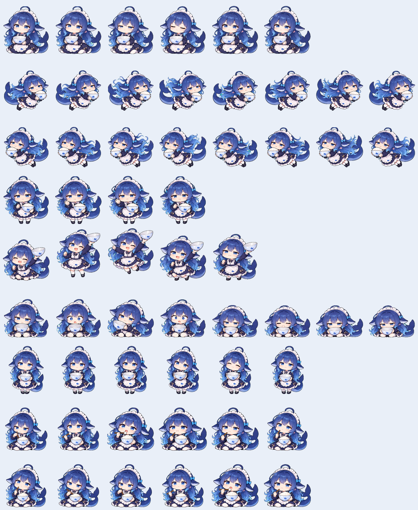

# Deepseek鲸鱼娘 v1.1.0

以原始八格设定图为视觉基准重制的 Codex 宠物。

## 本版变化

- 更贴近参考图的蓝紫长发、半眯眼、女仆裙和鲸尾。
- 左右拖动改为悬空护饭碗，头发与鲸尾朝拖动的反方向飘。
- 运行与思考混搭：夹饭、送入口、鼓腮咀嚼、停筷歪头，再继续吃；饭碗始终在手里。
- 开心跳跃改为举空碗庆祝；等待时递碗，出错时垂耳。

## 使用

将 `deepseek-rice-whale` 文件夹复制到 Windows 的 `%USERPROFILE%\.codex\pets\` 或 macOS / Linux 的 `~/.codex/pets/`。在 Codex 宠物选择器中选择“Deepseek鲸鱼娘”，必要时重新打开 Codex 刷新素材。

打开 `preview.html` 可选择动作，并在角色上左右拖动查看护碗动作。附有原生速度的运行和拖动 GIF，以及 12.5 FPS 的扩展吃饭思考预览。

## 帧率说明

已检查本机 Codex 26.903.8094.0 的实际配置解析与动画代码。宠物配置不支持自定义帧率；原生运行行固定6帧，前5帧各120ms、末帧220ms；思考行固定6帧，前5帧各150ms、末帧280ms。左右拖动调用左右移动动画行。

本宠物包保持兼容的 8×9 布局、192×208 单帧、1536×1872 透明无损 WebP，57个有效帧。没有修改 Codex 程序。提高帧率仅在预览页和扩展 GIF 中生效，不代表原生宠物能以该速度播放。扩展吃饭思考循环包含8个不同的生成姿势，未做交叉淡化或宣称插值产生了新动作。

## 验证与限制

已检查图集尺寸、透明通道、空白格、帧内边界和绿底残留，并查看动作总览、修正相邻角色碎片及运行思考姿势的高度变化。详见 `validation.json`。没有在 Codex 原生窗口逐个触发状态验证。

此版本未实现独立休眠事件；拖动停止或使用不同交互模式时的回退行为由 Codex 决定。

使用内置 image_gen 生成，以用户指定设定图为参考，使用 Sharp 完成去绿幕、连通区域提取、帧对齐和打包。生成提示词见 `prompts.json`。这是非官方同人创作。

## 动画预览

运行（原生速度）：

拖动（原生速度）：

扩展循环（仅预览，12.5 FPS）：

